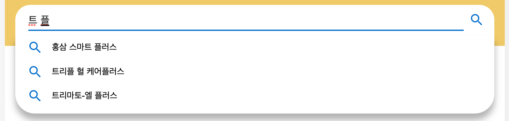
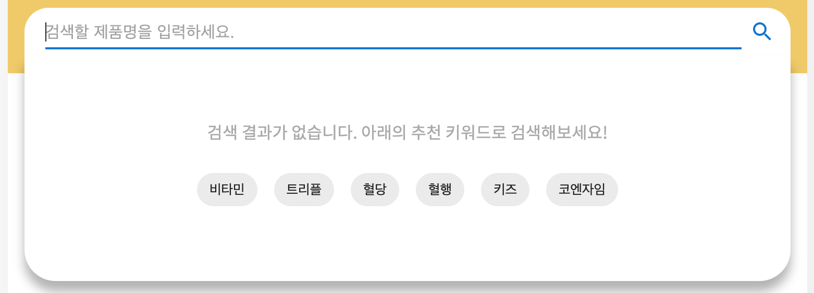

# [원티드X위코드 프리온보딩 코스] 4주차 기업과제<br /> 💊 영양제 검색

<br />

## :speaking_head: 1. 프로젝트 소개

> 소비자가 한글과 영어가 혼재된 영양제들의 제품명과 브랜드명을 검색을 통해 잘 찾을 수 있게 도와주는 검색창을 구현합니다. 

- 팀 프로젝트 (3인)
- 제작기간: 2021.02.17 ~ 2021.02.19
- 팀 저장소: https://github.com/OnBoarding-Park-is-best/week3-nutritional-supplements

<br />

## :rocket: 2. DEMO LINK

#### 🔗 **과제물**(netlify): https://park-is-best-supplements.netlify.app/ <br />

<br />

## :books: 3. 사용된 기술 스택

   

- TypeScript - v4.4.2
- React - v17.0.2
- Styled-Components - v5.3.3

<br />

## :electric_plug: 4. 프로젝트 실행 방법

1. git clone하여 프로젝트를 내려받습니다.
   ```bash
   git clone https://github.com/brad-go/wanted-nutritional-supplements.git
   ```
2. 아래 커맨드로 패키지를 설치합니다.
   ```bash
   yarn install
   ```
3. 아래 커맨드로 프로젝트를 실행합니다.
   ```bash
   yarn start
   ```

<br />

## :white_check_mark: 5. 팀 결정사항

#### 5-1. 반응형 기준

```css
/* 테블릿 가로, 테블릿 세로 (해상도 768px ~ 1023px)*/
@media all and (min-width: 768px) and (max-width: 1023px) {
  ...;
}

/* 모바일 가로, 모바일 세로 (해상도 480px ~ 767px)*/
@media all and (max-width: 767px) {
  ...;
}
```

- 768px, 1024px을 기준으로 반응형 웹을 구성합니다.
- PC 환경을 기준으로 CSS를 작성한 후 모바일 환경에 대한 CSS를 작성합니다.

#### 5-2. 타입스크립트 사용: 컴포넌트 타입 지정 방식

```tsx
interface SampleComponentProps {
  onClick: React.MouseEventHandler;
  selected?: boolean;
}

const SampleComponent = ({ onClick, selected }: **SampleComponentProps**) => {
  return <div onClick={onClick}>{selected ? 'yes' : 'no'}</div>;
};
```

- React.FC 대신 Props용 interface를 사용합니다.
- 함수형 컴포넌트의 return type(JSX.Element)은 생략합니다.

<br />

## :gear: 6. 구현사항

### 6-1. 영양제 검색 기능

<div align="center">
  
</div>

&nbsp;사용자들이 영양제 이름을 정확히 모를때가 있고 영문과 한글이 혼용되어 있기 때문에, 초성검색 및 정확한 영양제의 이름을 입력하지 않더라도 비슷한 결과를 보여주는 검색 기능을 구현했습니다. 

### 6-2. 검색어 자동완성 및 추천 키워드 기능

<div align="center">
  
</div>

&nbsp;사용자의 입력값이 변할 때마다 영양제 리스트에 있는 목록 중에 입력 문자를 가지고 있는 제품을 보여주는 자동완성 기능을 구현했습니다. 또, 입력값이 없을경우 추천 키워드가 보이도록 만들었습니다.  

**[코드 보기](https://github.com/brad-go/wanted-nutritional-supplements/blob/c3a2c21f17055d804542937a34a5a15018ec24d0/src/components/Dropdown/Dropdown.tsx#L1)**

<br />

## :boom: 7. 핵심 트러블 슈팅
### 7-1. 검색 기능 구현 방식

&nbsp;검색 기능을 구현하기 위해 저는 세가지 방식으로 시도를 해봤습니다. 사용자들이 영양제 이름을 정확히 모를때가 있고 영문과 한글이 혼용되어 있기 때문에, 초성검색 및 정확한 영양제의 이름을 입력하지 않더라도 비슷한 결과를 보여주는 검색 기능이 필요했기에 정규식을 이용한 퍼지 검색 기능으로 구현하게 되었습니다. 

#### 1) 배열 메서드를 이용한 검색 기능 구현

&nbsp;첫번째는 배열의 `filter()` 메서드와 `includes()` 메서드를 이용해서 검색기능을 구현하는 것이었습니다. 이 방법은 간단하게 구현이 가능하지만, **한글 초성 검색이 불가**능해 정확한 영양제명을 검색해야 했습니다. 또, **검색 가중치 설정이 불가**능해 특정 검색 결과를 우선적으로 보이게 할 수 없었습니다. 

<details><summary><b>코드 보기</b></summary><div markdown="1">

```tsx
const [inputValue, setInputValue] = useState<string>('');
const [result, setResult] = useState<NutritionType[]>([])

...
const handleSubmit = () => {
  setResult(nutritionList.filter((list) => list.includes(inputValue)))
}
```

</div></details>

#### 2) 라이브러리를 이용해서 구현

&nbsp;조금 더 성능이 뛰어난 검색 기능을 구현하기 위해 방법을 찾다가 한글 초성 검색을 위해 도와주는 라이브러리 **hangul-js**와 퍼지 검색을 도와주는 **fuse.js**를 발견했습니다. 그리고 이를 통해 간단히 한글 초성 검색과 검색 가중치 설정을 통해 우선적으로 보일 검색 결과를 설정할 수 있었습니다. 

&nbsp;이 두가지 라이브러리를 통해 정말 간단하게 검색 기능을 구현할 수 있었지만, 이게 개발을 하는게 맞는건가 의심이 들고, 제가 한 개발이 맞는건가 싶었습니다. 저 **한글 초성 분리**와 fuse를 이용한 **퍼지 검색**도 조금 더 천천히 해보면 직접 구현할 수 있지 않을까? 라고 생각했고, 이대로 라이브러리를 사용하는건 기업과제의 의의에도 어긋난다고 생각해서 **직접 개발하기로 결정**했습니다. 

<details><summary><b>코드 보기</b></summary><div markdown="1">

#### 필요한 패키지 설치

```bash
yarn add fuse.js hangul-js
```

#### 코드

```tsx
import axios from "axios";
import Fuse from "fuse.js";
import * as hangul from "hangul-js";

import React, { useState, useEffect } from "react";

function List(props) {
  const { data } = props;

  return (
    <ul style={{ listStyle: "none" }}>
      {data &&
        data.length > 0 &&
        data.map((d) => {
          // if (d.score < 0.3) 이건 검색 자동완성에서 쓰면 좋을 듯
          return <li key={d.item.id}>{d.item.productName}</li>;
        })}
      {data && data.length === 0 && <li>결과 없음</li>}
    </ul>
  );
}

function App() {
  const [nutritionList, setNutritionList] = useState([]);
  const [search, setSearch] = useState({
    query: "",
    result: [],
  });

  const handleChange = ({ target }) => {
    const query = target.value;
    const result = fuse.search(hangul.d(query).join(""));
    setSearch({ query, result });
  };

  useEffect(() => {
    const getData = async () => {
      const { nutritionList } = await axios.get("data/nutrition_list.json").then((res) => res.data);
      const productList = nutritionList.map((list, idx) => ({
        id: idx + 1,
        ...list,
        // 초성 검색이 가능하도록 분리해서 저장
        char: hangul
          .d(list.productName, true)
          .map((word) => word[0])
          .join(""),
        seperated: hangul.d(list.productName).join(""),
      }));

      setNutritionList(productList);
    };
    getData();
  }, []);

  // Fuse 옵션
  const options = {
    shouldSort: true, // 점수(0 ~ 1) 순으로 정렬
    includeScore: true, // 결과에 점수 포함
    // includeMatches: true, // 결과에 일치 항목 포함
    threshold: 0.1, // 매치 알고리즘 정도 0 ~ ₩
    location: 1, // 검색 문자열 어디부터 할지 위치 결정, 이거에 따라 점수가 달라짐
    distance: 100,
    minMatchCharLength: 1, // 문자 길이가 이 값을 초과하는 일치 항목만 반환
    keys: ["productName", "seperated", "char"], // productName과 분리한 문자열, 초성을 비교
  };

  let fuse = new Fuse(nutritionList, options);

  return (
    <div className="App">
      <label>
        제품 검색:
        <input type="text" onChange={handleChange} value={search.query} />
      </label>
      <List data={search.result} />
    </div>
  );
}

export default App;
```

</div></details>


#### 3) 정규식을 사용한 Fuzzy String Search

&nbsp;따로 한글을 초성 분리하는 함수를 만들고, 반복문을 통해 검색 기능을 구현하려고 했었습니다. 하지만 이는 시간복잡도가 우려되어 결과적으로 저는 [한글도 지원하는 퍼지 문자열 검색](https://taegon.kim/archives/9919)이라는 글을 참고해서 검색 기능을 만들어보기로 결정했습니다. 

유저의 입력이 들어오면 **입력값을 쪼개서** '가-힣' 사이의 문자에 해당하는지 혹은 한글 자음인지 체크해서 **정규식으로 만들어줍니다**. 그리고 이를 영양제의 이름이나 브랜드와 비교해서 포함하는게 있다면 화면에 보여줍니다. 

**[코드 보기](https://github.com/brad-go/wanted-nutritional-supplements/blob/c3a2c21f17055d804542937a34a5a15018ec24d0/src/utils/search.ts#L4)**

### 7-2. 검색 가중치 설정

#### :exclamation: 문제

&nbsp;비슷한 결과값을 모두 보여주는 검색 방법이다 보니 결과값을 보여주는 순서에 문제가 있었습니다. '**트리플**'을 검색하면 이를 온전히 포함한 결과값이 최상단으로 나와야 하는데, '**트리마토-엘 플러스**' 등의 문자열을 포함한 모든 제품들이 받아온 데이터에 저장되어 있는 순서대로 보여지는 문제가 있었습니다. 

<details><summary><b>기존 코드</b></summary><div markdown="1">

```tsx
const search = (value: string) => {
  // 입력값을 정규식으로 전환
  const regex = createFuzzyMatcher(value.toLowerCase());

  // 받아온 영양제 리스트 데이터에서 정규식을 통과하는 것들만 결과로 담음
  const result = data.filter((product) => {
    return regex.test(product.productName.toLocaleLowerCase());
  });

  // 자동완성 데이터에 적용
  setPreview(result.map(({ productName }) => productName));
  return result;
}
```

</div></details>

#### :white_check_mark: 해결

&nbsp;문제를 해결하기 위해 검색 가중치를 설정해서 문자열을 온전히 포함한 제품들이 상단에 보여지게 만들어야 했습니다. 정규식을 통해 한 번 걸러진 문자열을 포함한 제품들을 한번 더 필터링 해줘야 했습니다. 이 각각의 문자열들의 길이를 구했고, 이를 `sort()` 메서드를 통해 다시 한번 정렬하는 과정을 거쳐서 해결할 수 있었습니다. 

```tsx
const search = (value: string) => {
  const regex = createFuzzyMatcher(value.toLowerCase());
  
  // 수정사항. sortResult 함수에 객체로 데이터를 넘김
  const result = sortResult({
    arr: data.filter((product) =>
      regex.test(product.productName.toLowerCase()),
    ),
    val: value,
    regex,
    searchType,
  });

  setPreview(result.map(({ productName }) => productName));
  return result;
}
```

**[코드 보기](https://github.com/brad-go/wanted-nutritional-supplements/blob/c3a2c21f17055d804542937a34a5a15018ec24d0/src/utils/search.ts#L65)**

### 7-3. 검색 성능

#### :exclamation: 문제

&nbsp;이제 제대로된 순서로 자동완성과 검색 결과를 볼 수 있었지만, 지금의 코드는 유저의 입력마다 필터링 과정이 거치게 됩니다. 지금 정도의 데이터라면 괜찮지만, 사용자가 많고 대량의 데이터를 다룬다면 과부하가 생길 것이기 때문에 약간의 수정이 필요했습니다. 

#### :white_check_mark: 해결

&nbsp;쓰로틀링과 디바운싱 중에 어떤 방법을 사용해야 할지 고민했지만, 쓰로틀링을 사용하게 되면 일정 시간 동안의 검색한 것이 무시되어 제대로된 결과가 보여지지 않을 것이기 때문에 **디바운싱**을 사용해서 문제를 해결했습니다.

```tsx
const timerId = useRef<ReturnType<typeof setTimeout> | null>(null);

const handleInputChange = (e: React.ChangeEvent<HTMLInputElement>) => {
  const value = e.target.value;

  ...

  if (timerId.current) {
    clearTimeout(timerId.current);
  }

  timerId.current = setTimeout(() => {
    timerId.current = null;
    // 문자열에 해당하는 영양제 목록을 반환하는 함수
    search(value);
  }, 200);
}
```

**[코드 보기](https://github.com/brad-go/wanted-nutritional-supplements/blob/c3a2c21f17055d804542937a34a5a15018ec24d0/src/App.tsx#L78)**

<br />

## :open_file_folder: 7. 디렉토리 구조

```bash
.
├── api
├── components
│   ├── BlankContainer
│   ├── Dropdown
│   └── ProductItem
├── constants
├── hooks
├── styles
├── types
└── utils
```

<br />

## :pray: 8. 회고 및 느낀점

&nbsp;구글 검색 기능이 얼마나 뛰어난 검색 기능인지 깨닫게 되는 프로젝트 였습니다. 검색 성능을 테스트 해볼 수 있는 방법이 해당 문자열을 포함하는 결과를 보여주는 것 말고는 떠오르지 않아서 조금 아쉽습니다. 다른 테스트 방식이 떠오른다면 꼭 다시 테스트해보고 싶습니다. 

&nbsp;정규식을 다룬 검색 방식의 글을 참고해서 프로젝트를 진행했는데, 정규식을 사용하면 복잡한 조건문을 상당히 많이 간소화 할 수 있다는 것을 알게되었습니다. 기회가 된다면 정규식을 제대로 공부하고 다시 이 프로젝트를 진행해보고 싶습니다. 